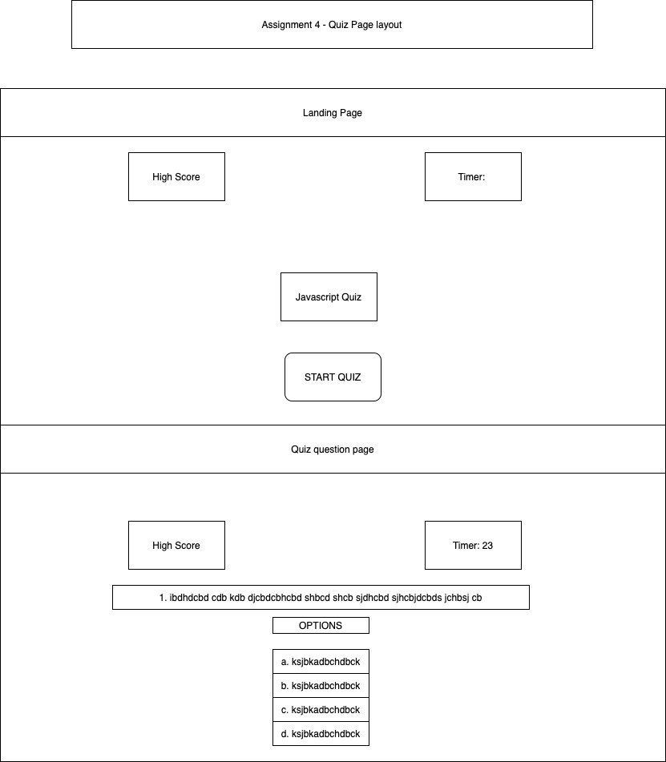
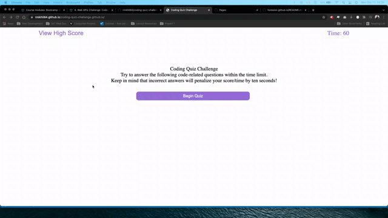

# coding-quiz-challenge.github.io

## Purpose
Build a coding quiz which displays a question and several options for answer. Selecting one of the options, if corrects increases the score by 10, or if incorrect decreases the time remaining b 10 seconds

## Built With
* Javascript
* HTML
* CSS

## Git Hub Repository
https://github.com/nnikhil84/coding-quiz-challenge.github.io 

## Deployed Website
https://nnikhil84.github.io/generate.passwords.github.io/

## Task Achieved
* Created a pulic remote repository on Git Hub 
* Cloned the repository on the local system
* Created README.md
* Created develop and feature/html branches and wrote html code in the branch to give structure to the webpage
* Merged feature/html to develop and pushed to remote repo 
* Created feature/css branch to give styling to the page as per the requirements
* Merged feature/css to develop and pushed to remote repo 
* Created feature/javascript branch to give functionality to quiz
* Merged feature/javascript to develop and pushed to remote repo 

## Resources Used
* https://www.w3schools.com/js/js_variables.asp
* https://www.w3schools.com/js/js_strings.asp
* https://developer.mozilla.org/en-US/docs/Mozilla/Add-ons/WebExtensions/Interact_with_the_clipboard
* https://developer.mozilla.org/en-US/docs/Web/JavaScript/Guide/Functions
* https://developer.mozilla.org/en-US/docs/Web/JavaScript/Guide/Loops_and_iteration

## Code quiz functionality

